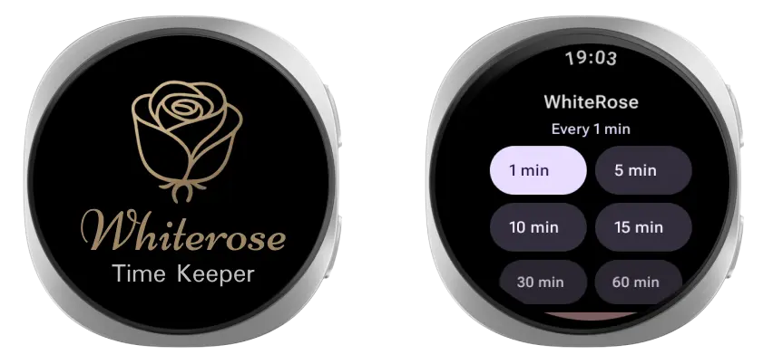

# Whiterose - Time Keeper
A minimalist watch app (Android WearOS) that emits a periodic beep at a fixed interval to keep you aware of time passing.

## Screenshot

## Inspiration
Inspired by the character Whiterose from Mr. Robot, who treats time as a precise and controlled resource.

> "This meeting has started, I manage my time very carefully mr. Alderson, each beep indicates one minute of my time that has passed I have allotted you no more than 3 minutes."  
— Whiterose

> "Every hacker has their fixation. You hack people, I hack time."
> — Whiterose

